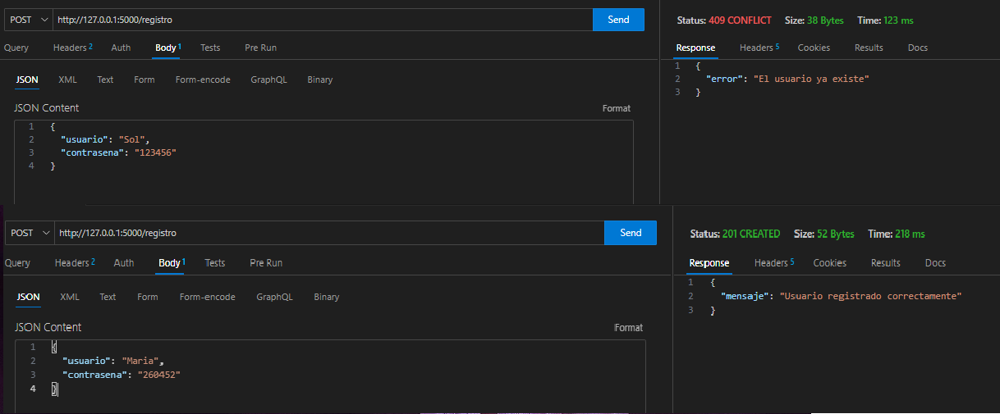
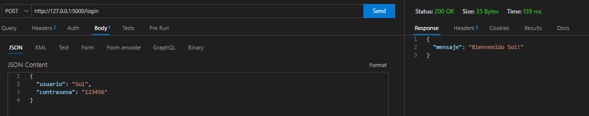
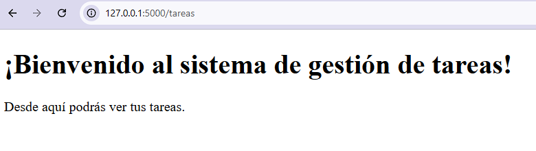

# Sistema de Gestión de Tareas (PFO2)

## a) Descripción del proyecto

API en Python con Flask + SQLite que permite:
- Registrar usuarios con contraseñas hasheadas
- Iniciar sesión
- Ver un HTML de bienvenida

## b) Requisitos
- Python 3.10 o superior
- Librerías: Flask, Werkzeug

## c) Instalación y ejecución
### Crear entorno virtual
python -m venv venv
### Activar venv
### Windows
venv\Scripts\activate
### Linux/Mac
source venv/bin/activate

### Instalar dependencias
pip install Flask Werkzeug

### Inicializar la base de datos
python init_db.py

### Ejecutar servidor
python server.py

## d) Cómo probar

Registro: POST a /registro con JSON {"usuario":"Sol", "contrasena":"123456"}

Login: POST a /login con JSON {"usuario":"Sol", "contrasena":"123456"}

HTML de bienvenida: GET a /tareas desde navegador

## Capturas de pantalla

### Registro de usuario

### Login exitoso

### HTML de bienvenida
